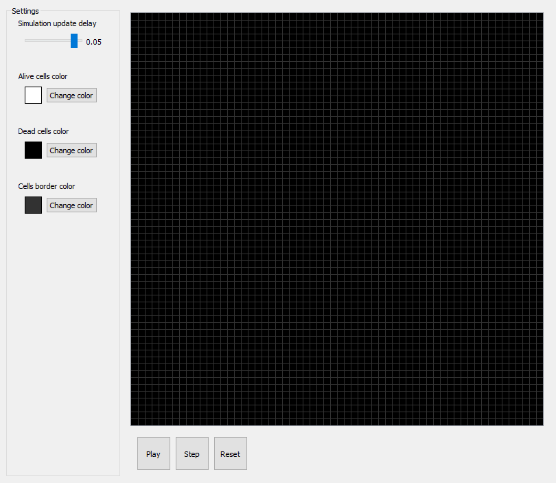
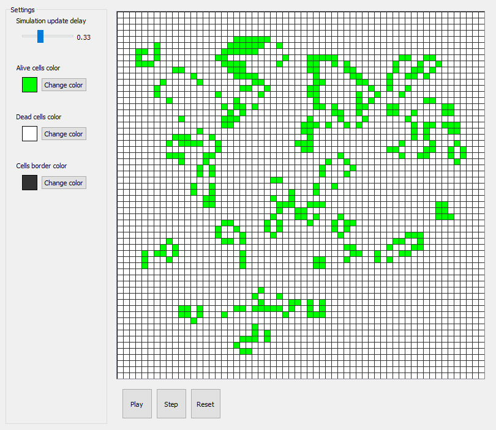
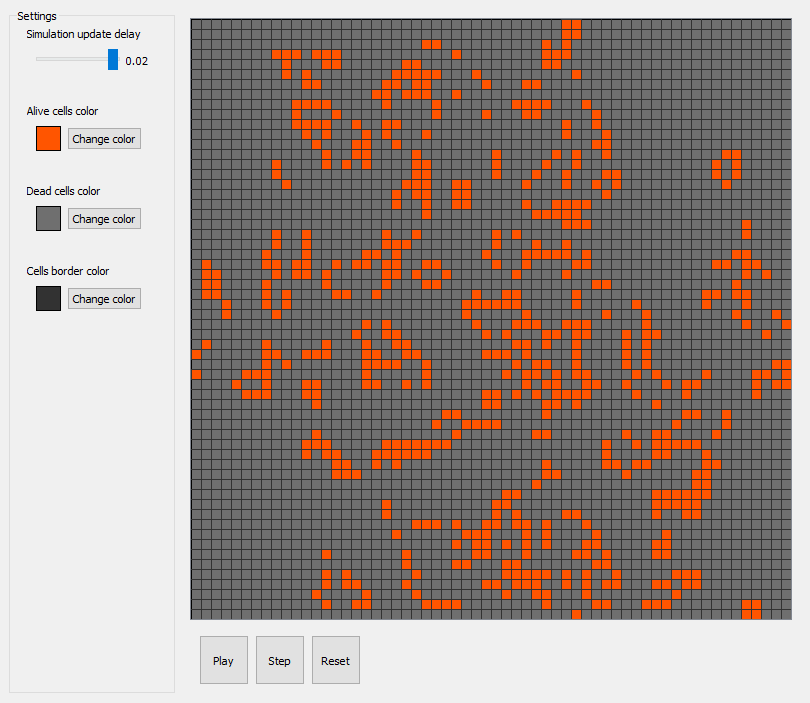

# Game of Life - PyQt project

**Проект для Яндекс.Лицея - "Игра в жизнь", клеточный автомат.**

### Авторы
- Жидяев Сергей

### Идея: 
Место действия игры — размеченная на клетки плоскость, которая может быть безграничной, ограниченной или замкнутой.
Каждая клетка на этой поверхности имеет восемь соседей, окружающих её, и может находиться в двух состояниях: быть «живой» (заполненной) или «мёртвой» (пустой).

Распределение живых клеток в начале игры называется первым поколением, а каждое следующее поколение рассчитывается на основе предыдущего по таким правилам:
- в пустой (мёртвой) клетке, с которой соседствуют три живые клетки, зарождается жизнь;

- если у живой клетки есть две или три живые соседки, то эта клетка продолжает жить; в противном случае (если живых соседей меньше двух или больше трёх) клетка умирает («от одиночества» или «от перенаселённости»).

Игрок не принимает активного участия в игре. Он лишь расставляет или генерирует начальную конфигурацию "живых" клеток, которые затем изменяются согласно правилам. Несмотря на простоту правил, в игре может возникать огромное разнообразие форм.

В проекте игрок может создавать начальные условия симуляции, "закрашивая" на выделенном поле клетки, а после просматривать изменения поколений, пошагово или циклично.
Поле можно приближать/отдалять, чтобы сфокусироваться на определённой области или увеличить обзор.
Также игрок может изменять задержку между шагами в цикле симуляции (для её ускорения/замедления), а также цвет поля и клеток.
В проекте планируется справочник для новичков с описанием принципов симуляции и набором различных простых и комплексных фигур.

### Реализация:
Для создания поля используется связка QGraphicsScene, QGraphicsView и QPainter для рисования поля. QGraphicsView может менять размер, не влияя на отрисовку поля, что позволяет увеличивать и уменьшать его без технических сложностей.
Алгоритм поля самописный, описан отдельным классом Field.
UI самописный, без использования Qt Designer.
Для настройек используются самописные классы виджетов с использованием наследования, переопределения.
Цикличность смены поколений работает через QTimer.
Страницы справочника хранятся в файлах HTML.
Используются базы данных для объединения страниц в категории, объединения фигур по типам, связи фигур и страниц и т.д. 

### Использованные технологии:
- PyQt5=5.15.4
- Остальное самопис

